# AoiChangChaos_rust
のーふぉん(Twitter:@4th_No_Fon)さん制作の動画シリーズ「[琴葉葵の混沌解析][1]」にて紹介されたデータ同化シミュレーションをRustで実装した支援コードです。

##  ~~◤◢◤◢◤◢◤◢ CAUTION ◤◢◤◢◤◢◤◢~~
### ~~本リポジトリには[Part3][2]・[Part4][3]・[part5][4]・[Part6][5]の実装が含まれますが、現状シミュレーション結果が再現せず、何らかの不具合を抱えている可能性があります。~~

~~詳細は後述、もしくはoutputs/Season2及びoutputs/Season2/part6・outpus/Season2/part6/appendixを参照。~~

#### 実験は再現されました。
ので汚いのとパラメータ変更が手間な以外、本リポジトリに大きな問題はないものと思われます。


## Contents
### sin_generator
[part2][6]、sin波にガウシアンノイズを付与したデータを出力するバイナリ。
```
sin_generator.exe output_file_path data_interval number_of_data random_seed
```
で実行可能。

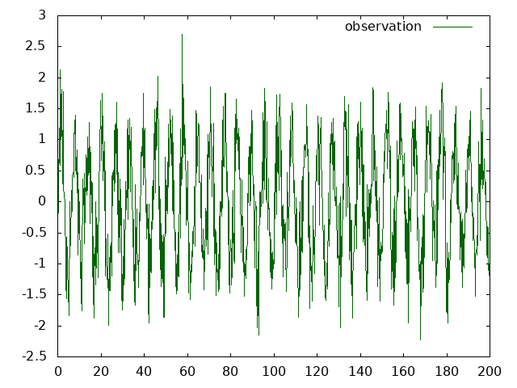

sin波に平均0分散1のガウシアンノイズを付与した。

### read_and_write
各種バイナリ・ライブラリに共通のファイル読み書きライブラリ。


### kalman_filter
[part2][6]、カルマンフィルターの実装ライブラリ。
```
cargo run --example sin_test input_file_path output_file_path
```
にてsin_generatorで生成したデータを指定することで[part2][6]のシミュレーションを実行可能。

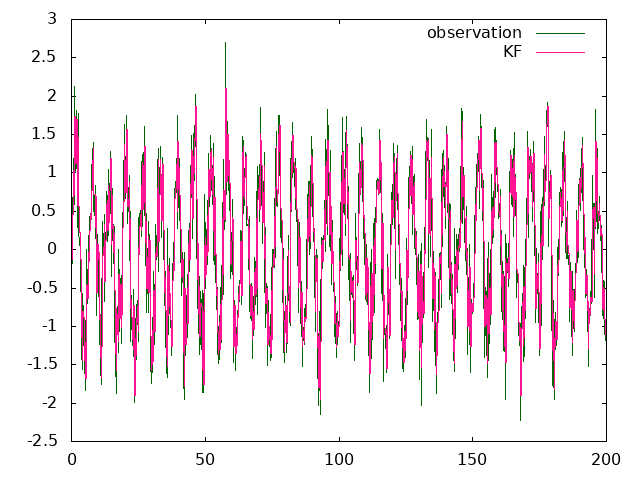

カルマンフィルタを用いた一階トレンドモデルによるシミュレーション

### ensemble_kalman_filter
[part3][2]、アンサンブルカルマンフィルターの実装ライブラリ。
```
cargo run --example sin_test input_file_path output_file_path
```
にてsin_generatorで生成したデータを指定することで[part3][2]のシミュレーションを実行可能。

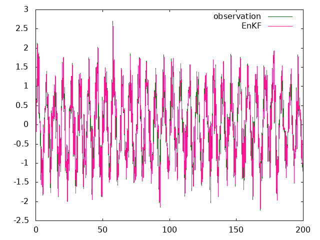

アンサンブルカルマンフィルタを用いた一階トレンドモデルによるシミュレーション

また
```
cargo run --example lorenz96_try_e input_file_path output_variance_path output_file_path
```
にてlorenz96_generator(後述)で生成したデータを指定することで[part6][5]のシミュレーション実行可能。

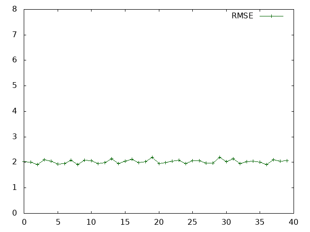

アンサンブルカルマンフィルタを用いて時刻0.2ごとに観測したRMSE

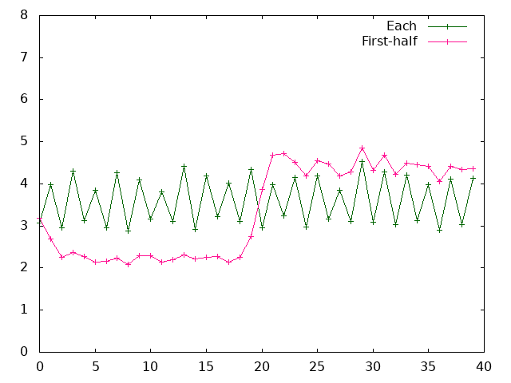

アンサンブルカルマンフィルタを用いて偶数次元のみ観測した場合と前半20次元のみ観測した場合のRMSE。共に時刻0.2ごとに観測。

~~[part6][5]において観測されていない次元のRMSEが4前後となっているところ、本プログラムにおいては50～100と完全に同化が失敗している。~~

~~※ outputs/Season2/part6/true_enkf_res_skip02_each_rmse.ssv~~

~~※ outputs/Season2/part6/true_enkf_res_skip02_first_half_rmse.ssv~~

### merging_particle_filter
[part4][3]、融合粒子フィルターの実装ライブラリ。
```
cargo run --example sin_test input_file_path output_file_path
```
にてsin_generatorで生成したデータを指定することで[part4][3]のシミュレーションを実行可能

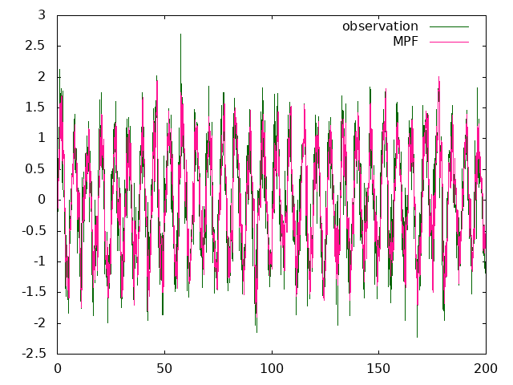

融合粒子フィルタを用いた一階トレンドモデルによるシミュレーション。システムノイズは平均0分散0.36

また
```
cargo run --example lorenz96_try input_file_path output_variance_path output_file_path
```
にてlorenz96_generator(後述)で生成したデータを指定することで[part6][5]のシミュレーションを実行可能。

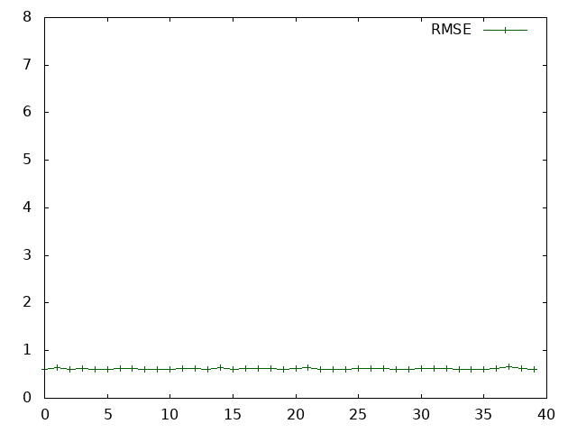

融合粒子フィルタを用いて全ての時刻・次元を観測したRMSE

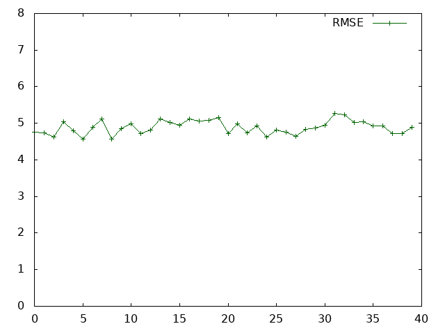

融合粒子フィルタを用いて時刻0.2ごとに観測したRMSE

~~[part6][5]においてRMSEが0.6前後となっているところ、本プログラムにおいては1.0前後となっており、実行結果に乖離がある。~~

~~※ outputs/Season2/part6/true_mpf_res_all_rmse.ssv~~

### lorez96
[part5][4]、Lorenz96の4段4次ルンゲクッタ法による実装ライブラリ。
素直にこれをする分にはeomなどのcrateを用いた方が良い。
```
cargo run --example naive output_file_path
```
とすることで実行可能。

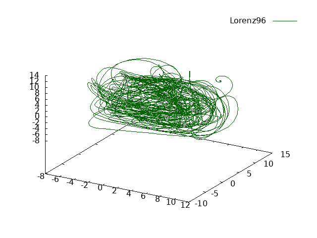

全ての次元を8.0にした後0(1)次元目にのみ1e-3を加えた場合の0～2(1～3)次元目を描画。これが本実験での真の値となる。

また
```
cargo run --example lyapunov input_true_file_path input_diff_file_path output_file_path
```
とすることで0次元(1次元)目のリアプノフ指数を評価可能。

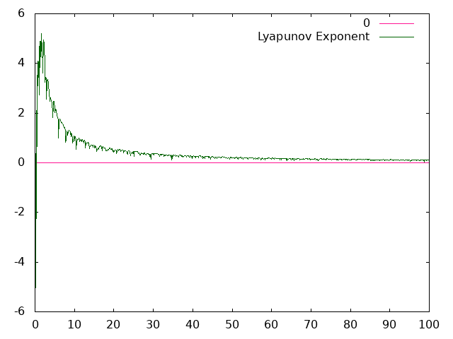

全ての次元を8.0にした後0(1)次元目に1e-3を加えた場合と更に1e-4を加えた場合の0(1)次元目のリアプノフ指数の遷移

### lorenz96_generator
[part6][5]、ローレンツにガウシアンノイズを付与するバイナリ。
```
lorenz96_generator.exe input_file_path output_file_path
```
とすることで実行可能。

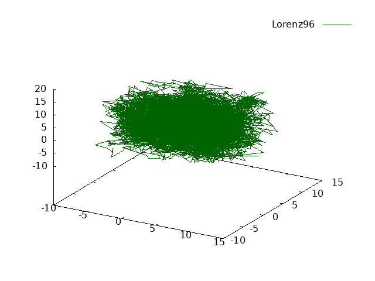

先に描画したグラフの結果に平均0分散1のガウシアンノイズを付与した。これが本実験での観測値となる。

先述した評価値が悪い問題の原因が乱数生成器の違いにあるのではないかと予測し、動画に合わせたメルセンヌツイスタを使用したコードと当初のxoshiroを使用したコードとが存在する。

※なおこの予測は誤り。

### rmse_evaluator
[part6][5]、実行結果と真の値を用いて次元別にRMSEを出力するバイナリ。
```
rmse_evaluator.exe input_true_file_path input_estimated_file_path output_file_path estimated
```
で実行可能。

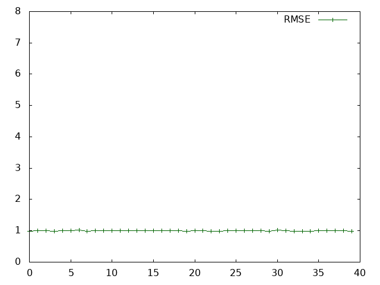

本実験における真の値と観測値とのRMSEを算出した結果

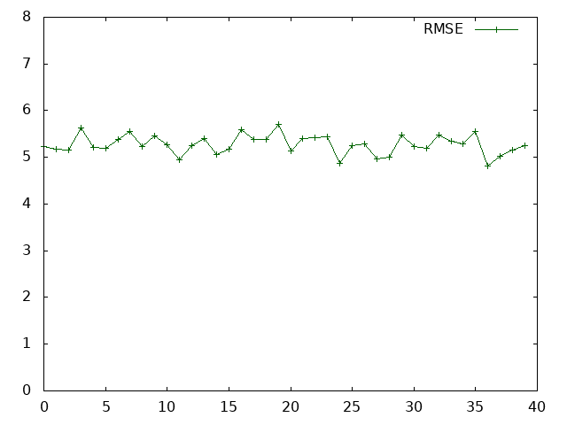

本実験における真の値と原点の0(1)次元目に1e-3を加えた場合のRMSEを算出した結果。動画中では言及されてないが原点からのみ結果だとRMSEが7弱となるため動画中で表示されているグラフは恐らくこちら。

最後のコマンドライン引数は2詰めの引数(input_estimated_file_path)が実行結果の場合time=0.0が含まれているのでそれをスキップする場合にestimatedを指定する。

入力ファイルが共にtime=0.0を含まない場合任意の文字列を入れておけばよい。

[1]:https://www.nicovideo.jp/series/236665?ref=pc_watch_description_series
[2]:https://www.nicovideo.jp/watch/sm38965478
[3]:https://www.nicovideo.jp/watch/sm38966401
[4]:https://www.nicovideo.jp/watch/sm38998520
[5]:https://www.nicovideo.jp/watch/sm39010792
[6]:https://www.nicovideo.jp/watch/sm38961218